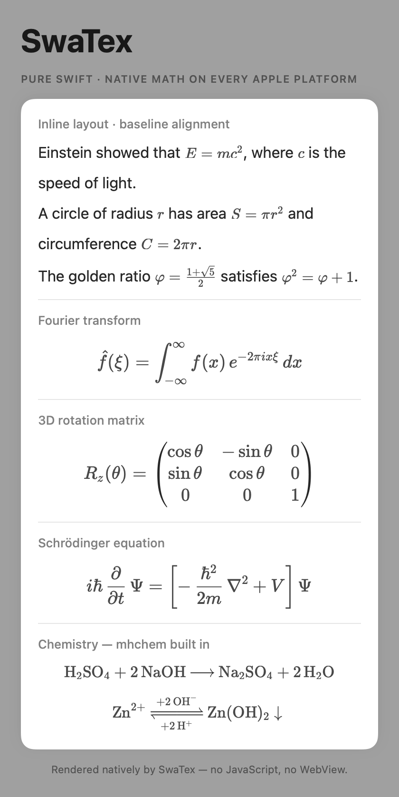
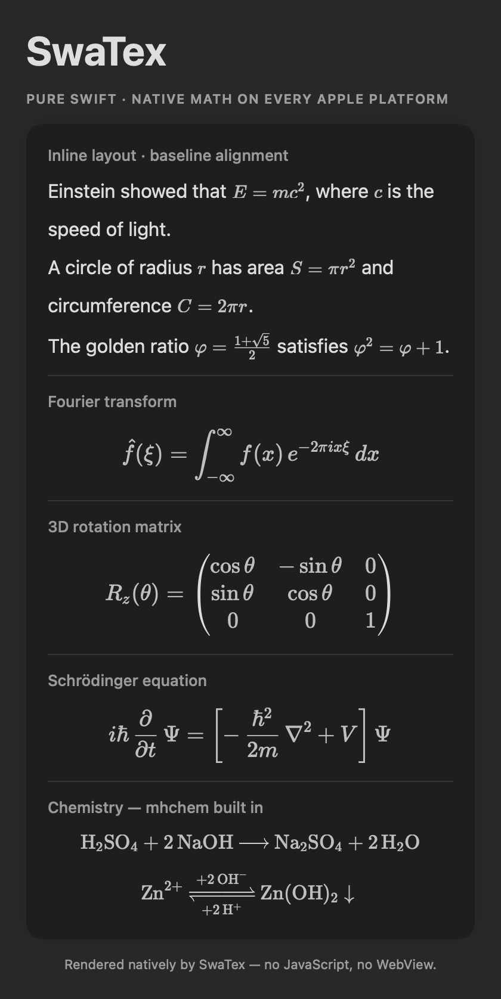

# SwaTex

**KaTeX-compatible math rendering engine in pure Swift — no JavaScript, no WebView, no DOM.**

<p>
  <a href="https://github.com/PhraseHQ/SwaTex/actions/workflows/ci.yml"></a>
  
  
  <a href="LICENSE"></a>
  <a href="https://phrase.so?utm_source=github&utm_medium=readme&utm_campaign=swatex"></a>
</p>

SwaTex is a ground-up Swift port of [RaTeX](https://github.com/erweixin/RaTeX), the Rust KaTeX-compatible math renderer, built and maintained by the team behind [Phrase](https://phrase.so?utm_source=github&utm_medium=readme&utm_campaign=swatex) — it renders every formula in Phrase's AI notes on iOS and macOS. One Swift core, one display list, native rendering on every Apple platform:

```
\frac{-b \pm \sqrt{b^2-4ac}}{2a}   →   iOS · macOS · tvOS · watchOS · visionOS · SVG · PNG
```

<table>
  <tr>
    <th>Light</th>
    <th>Dark — adaptive colors built in</th>
  </tr>
  <tr>
    <td></td>
    <td></td>
  </tr>
</table>

<sub>Generated straight from the library (SwiftUI `MathView`, dynamic
`.mathColor(.primary)`) by `Tests/SwaTexRenderTests/ScreenshotGenerator.swift` —
regenerate with `SWATEX_SCREENSHOTS=.github/assets swift test --filter Screenshot`.</sub>

## Why

Every major cross-platform math renderer runs LaTeX through a browser or JavaScript engine — a hidden WebView eating 50–150 MB RAM, startup latency before the first formula, no offline guarantee. SwaTex is the same KaTeX-compatible pipeline as a native Swift library:

- **Pure Swift 6** — value types, `Sendable` throughout, typed throws, `Synchronization.Mutex`. No Objective-C, no C dependencies.
- **KaTeX-metric-exact layout** — the layout engine drives TeX's box-and-glue rules from the bundled KaTeX font metrics, not from platform text APIs, so output matches KaTeX (and RaTeX) glyph-for-glyph.
- **Flat display list** — layout produces a renderer-agnostic `DisplayList` (glyphs, lines, rects, paths) whose JSON wire format is byte-compatible with RaTeX's, enabling cross-engine differential testing.
- **Native backends** — CoreText/CoreGraphics rendering with the bundled KaTeX fonts (no font registration side effects), SwiftUI `MathView`, PNG export via ImageIO, and an SVG string backend.

## What it renders

**Math** — **1007 of 1008 entries in the official KaTeX support table**;
the only exception is `\includegraphics`, which KaTeX itself gates behind
`trust`. (Four `\html*` commands render their content but drop DOM-only
attributes — there is no DOM in a native renderer.) Fractions, radicals,
integrals, matrices, environments (`pmatrix`, `align`, `cases`, `CD`, …),
stretchy delimiters, accents, macros (`\def`, `\newcommand`,
`\expandafter`), and more.

**Chemistry** — full mhchem support via `\ce` and `\pu` (state-machine port verified byte-identical to RaTeX on a 253-case corpus):

```latex
\ce{H2SO4 + 2NaOH -> Na2SO4 + 2H2O}
```

**Proof trees** — bussproofs-style `prooftree` for inference rules and sequent calculi.

## Installation

Swift Package Manager. In `Package.swift`:

```swift
dependencies: [
    .package(url: "https://github.com/PhraseHQ/SwaTex.git", from: "0.2.0")
]
```

Then add the product you need to your target — `SwaTexRender` for apps
(SwiftUI/UIKit/AppKit views, PNG; pulls in the core), or `SwaTex` alone for
the engine + SVG with zero platform dependencies:

```swift
.target(
    name: "YourApp",
    dependencies: [
        .product(name: "SwaTexRender", package: "SwaTex")
    ]
)
```

Or in Xcode: **File → Add Package Dependencies…** and paste
`https://github.com/PhraseHQ/SwaTex.git`.

Requires Xcode 16.3+ to build; deploys to iOS 18 / macOS 15 / tvOS 18 /
watchOS 11 / visionOS 2.

## Usage

```swift
import SwaTexRender  // SwiftUI + UIKit/AppKit + CoreGraphics (Apple platforms)

// SwiftUI
MathView(#"\sum_{n=1}^{\infty} \frac{1}{n^2} = \frac{\pi^2}{6}"#)
    .font(size: 24)

// UIKit / AppKit — built for block editors
let view = SwaTexView()
view.latex = #"\frac{a}{b}"#
view.fontSize = 18
view.mathStyle = .text            // inline
let baseline = view.baselineFromTop  // align with surrounding text runs

// PNG
let png = try ImageRenderer.png(latex: #"\frac{a}{b}"#)
```

`SwaTexView` is editor-grade by construction: parse+layout is memoized
through a shared formula cache (~100 ns for repeated formulas), property
sets are lazily coalesced (configuring a recycled cell costs one layout),
and on macOS the view renders via `updateLayer` — it owns its rasterized
bitmap, so scrolling and window redisplays never re-rasterize glyphs;
rasterization happens only when content, backing scale, or orientation
actually change (CI-asserted through real display cycles).

```swift
import SwaTex  // platform-independent core

// Parse → layout → display list (em units)
let list = try SwaTexEngine.displayList(for: #"x^2 + y^2 = z^2"#)

// SVG string
let svg = SVGRenderer().render(list)
```

## Architecture

```
LaTeX string
   │  Lexer            (KaTeX-compatible tokens, catcodes, \verb)
   │  MacroExpander    (builtin macro table, \def/\newcommand, mhchem \ce/\pu)
   │  Parser           (KaTeX ParseNode AST; functions + environments registries)
   │  Layout engine    (TeX box/glue rules from KaTeX font metrics → LayoutBox)
   ▼  toDisplayList    (flat, absolute-coordinate DisplayList in em units)
DisplayList ──► CoreGraphics/CoreText (SwaTexRender) ──► CGImage / PNG / SwiftUI
            └─► SVG string (core)
```

| Target | Contents | Dependencies |
|---|---|---|
| `SwaTex` | lexer, parser, mhchem, layout engine, SVG backend | none |
| `SwaTexRender` | CoreText/CG renderer, bundled KaTeX fonts, `MathView`, `SwaTexView` | `SwaTex` |
| `LayoutDump` | differential-testing CLI (mirrors RaTeX's `layout` binary) | `SwaTex` |

## Performance

Measured against the Rust reference engine on identical corpora, same
machine, median of 3 runs, with all 2 541 golden formulas bit-exact
between the engines. Every number is reproducible with the commands in
[BENCHMARKS.md](BENCHMARKS.md):

| Workload | RaTeX (Rust) | SwaTex |
|---|---|---|
| parse → layout → display list | 39.3 µs/formula | **16.3 µs/formula (2.4×)** |
| PNG batch, 100 formulas @40px 2× | ~200 µs/formula | **34 µs effective (parallel, 5.9×)** |
| repeated formula (editor cache hit) | 39.3 µs | **105 ns (~374×)** |
| editor scroll | — | **0 glyph rasterization (`updateLayer`)** |

## Requirements

- Builds with Swift 6.1+ (Xcode 16.3+); consuming apps can use any Swift language mode
- Deploys to iOS 18 / macOS 15 / tvOS 18 / watchOS 11 / visionOS 2
  (floor set by `Synchronization.Mutex`)

## Known limitations

- `\includegraphics` is not supported (the one missing entry of KaTeX's
  1008; KaTeX itself gates it behind `trust`). The four `\html*` commands
  render their content but drop DOM-only attributes.
- Deployment floors are iOS 18 / macOS 15 / tvOS 18 / watchOS 11 /
  visionOS 2 (`Synchronization.Mutex`). Apps targeting older OS versions
  cannot adopt SwaTex yet.
- Deliberate, documented divergences favor KaTeX over other engines:
  size units accept ASCII digits only (KaTeX's JS `\d`; Rust/Swift regex
  `\d` also accept Unicode digits), and tokenization steps by Unicode
  scalar, so combining marks on syntax characters behave like the JS/Rust
  references rather than Swift's grapheme clusters. Additional
  KaTeX-correct divergences from RaTeX (each pinned by a regression
  test): unterminated `\verb` and `x\limits^2` are parse errors instead
  of being silently accepted; `\vcenter` physically centers ink on the
  math axis; `\gdef`/`\xdef` survive group exit; zero-arg delimited
  `\def` macros validate and consume their parameter text; `\middle`
  nested deeper than 8 `\left…\right` stretch scopes renders at natural
  (unstretched) size.
- Shared with KaTeX/RaTeX upstream: `\begin{alignat}{N}` does not bound
  `N`; hostile inputs should be length-limited by the host app. Deeply
  nested input is guarded (recursion count + stack headroom → parse
  error, never a crash).
- Zero-redraw scrolling on macOS requires a layer-backed host hierarchy
  (`wantsLayer` — the default in modern AppKit apps).
- Native Apple platforms only: no React Native / Flutter / Web wrappers.

## Demo app

```sh
swift run SwaTexDemo   # interactive gallery: formulas, styles, sizes (macOS)
```

## Testing

```sh
swift test
```

The suite ports RaTeX's Rust tests: lexer/token, symbol/metrics tables, parser spec (KaTeX katex-spec.ts–derived), environments, mhchem, layout primitives, KaTeX SVG geometry, and renderer smoke tests. Cross-engine layout parity is checked with `scripts/diff_layout.py`, which diffs `LayoutDump` against RaTeX's `layout` binary over the 1000+-formula golden corpus.

## Who's behind SwaTex

<div align="center">
  <a href="https://phrase.so?utm_source=github&utm_medium=readme&utm_campaign=swatex">
    
  </a>

  <h3><a href="https://phrase.so?utm_source=github&utm_medium=readme&utm_campaign=swatex">Phrase — Turn Recordings & PDFs into AI Notes</a></h3>

  <p><b>Capture anything. Turn it into notes you can trust.</b><br>
  Phrase turns recordings, PDFs, images, and videos into source-backed AI notes,<br>
  slide decks, study tools, and dashboards — Apple-native, for notes that need proof.<br>
  SwaTex is the engine that renders every math formula in Phrase.</p>

  <p>
    <a href="https://apps.apple.com/app/phrase/id6779970822">
      
    </a>
    &nbsp;
    <a href="https://phrase.so?utm_source=github&utm_medium=readme&utm_campaign=swatex">
      
    </a>
    &nbsp;
    <a href="https://x.com/phraseapp">
      
    </a>
  </p>
</div>

## Contributing

See [CONTRIBUTING.md](CONTRIBUTING.md) — the short version: keep the
2 541 golden fixtures green, pin parser fast paths with differential
tests, run the formatter, and bring numbers for performance claims.
Security reports: [SECURITY.md](SECURITY.md).

## Fonts & licenses

The bundled KaTeX fonts (`Sources/SwaTexRender/Resources/Fonts`) are from the
[KaTeX](https://github.com/KaTeX/KaTeX) project, licensed under the SIL Open Font
License 1.1 (see `OFL.txt` / `FONT_NOTICE.txt` alongside the fonts).
